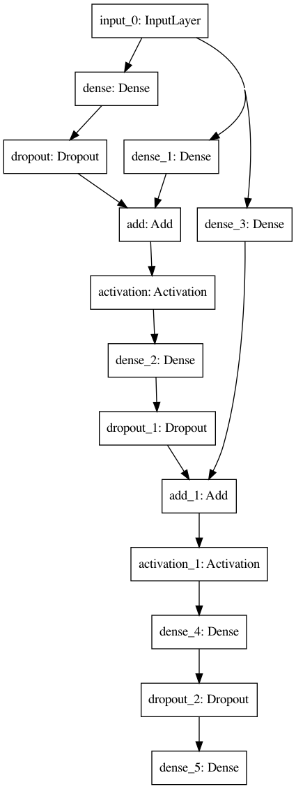

.. _tutorial-04:

Neural Architecture Search (Basic)
**********************************

.. warning::

    Be sure to work in a virtual environment where you can easily ``pip install`` new packages. This typically entails using either Anaconda, virtualenv, or Pipenv.

In this tutorial we will learn the basis of neural architecture search (NAS). To do so, we will use artificial data generated from a polynomial function. Then, we will discover how to create a search space of neural architecture using a directed graph. Finally, we will see how to define the NAS settings and how to execute the search.

Setting up the problem
=======================

Let's start by creating a new DeepHyper project workspace. This is a directory where you will create search problem instances that are automatically installed and importable across your Python environment.

.. code-block:: console
    :caption: bash

    deephyper start-project dh_project

A new ``dh_project`` directory is created, containing the following files:

.. code-block::

    dh_project/
        dh_project/
            __init__.py
        setup.py

We can now define DeepHyper NAS search problems inside this directory, using
``deephyper new-problem nas {name}``.

Let's set up a NAS problem called ``polynome2`` as follows:

.. code-block:: console
    :caption: bash

    cd dh_project/dh_project/
    deephyper new-problem nas polynome2

A new NAS problem subdirectory should be in place. This is a Python subpackage containing
sample code in the files ``__init__.py``, ``load_data.py``, ``search_space.py``, and ``problem.py``. Overall, your project directory should look like:

.. code-block::

    dh_project/
        dh_project/
            __init__.py
            polynome2/
                __init__.py
                load_data.py
                search_space.py
                problem.py
        setup.py

Load the data
=============

First, we will look at the ``load_data.py`` file that loads and returns the
training and validation data. The ``load_data`` function generates data from
a function :math:`f` where :math:`X \in [a, b]^n`  such as
:math:`f(X) = -\sum_{i=0}^{n-1} {x_i ^2}`:

.. literalinclude:: dh_project/dh_project/polynome2/load_data.py
    :linenos:
    :caption: polynome2/load_data.py

Test the function loading the data:

.. code-block:: console
    :caption: bash

    python load_data.py

The expected output is:

.. code-block:: python

    train_X shape: (8000, 10)
    train_y shape: (8000, 1)
    valid_X shape: (2000, 10)
    valid_y shape: (2000, 1)

Define a neural architecture search space
=========================================

Then, we will take a look at ``search_space.py`` which contains the code for
the neural network search_space definition.

.. literalinclude:: dh_project/dh_project/polynome2/search_space.py
    :linenos:
    :caption: polynome2/search_space.py

Visualize a randomly generated neural network from this search space:

.. code-block::

    python search_space.py

.. image:: _static/random_model.png
    :scale: 50 %
    :alt: random model from regression search space
    :align: center

Create a problem instance
=========================

Now, we will take a look at ``problem.py`` which contains the code for the
problem definition.

.. literalinclude:: dh_project/dh_project/polynome2/problem.py
    :linenos:
    :caption: polynome2/problem.py

You can look at the representation of your problem:

.. code-block:: console
    :caption: bash

    python problem.py

The expected output is:

.. code-block:: console

    Problem is:
    * SEED = 2019 *
        - search space   : dh_project.polynome2.search_space.create_search_space
        - data loading   : dh_project.polynome2.load_data.load_data
        - preprocessing  : deephyper.nas.preprocessing.minmaxstdscaler
        - hyperparameters:
            * verbose: 1
            * batch_size: 32
            * learning_rate: 0.01
            * optimizer: adam
            * num_epochs: 20
            * callbacks: {'EarlyStopping': {'monitor': 'val_r2', 'mode': 'max', 'verbose': 0, 'patience': 5}}
        - loss           : mse
        - metrics        :
            * r2
        - objective      : val_r2__last
        - post-training  : None

Execute the search locally
==========================

Everything is ready to run. Let's remember the structure of our experiment:

.. code-block::

    polynome2/
        __init__.py
        load_data.py
        problem.py
        search_space.py

Each of these files have been tested one by one on the local machine. Next, we will run a random search (RDM).

.. code-block:: console
    :caption: bash

    deephyper nas random --evaluator ray --problem dh_project.polynome2.problem.Problem --max-evals 10 --num-workers 2

.. note::

    In order to run DeepHyper locally and on other systems we are using :mod:`deephyper.evaluator`. For local evaluations we can use the :class:`deephyper.evaluator.RayEvaluator` or the :class:`deephyper.evaluator.SubProcessEvaluator`.

After the search is over, you will find the following files in your current folder:

.. code-block:: console

    deephyper.log
    init_infos.json
    results.csv
    save/

Let us visualize the training of our models:

.. code-block:: console

    deephyper-analytics quickplot save/history/*.json --xy epochs val_r2

.. image:: _static/val_r2.png
    :scale: 100 %
    :alt: model training curves
    :align: center

Now, let us check more precisely the Top-3 bests architectures found:

.. code-block:: console
    :caption: bash

    deephyper-analytics topk results.csv -k 3

Which outpout the following:

.. code-block:: yaml

    '0':
    arch_seq: '[0.6989673410461785, 0.3629513959562475, 0.9737897305250066, 0.3794147633221209,
        0.724613385206392, 0.524705251198639, 0.4287341558636125, 0.30551165683283954,
        0.43807640861070096, 0.2564984149608184, 0.2837501901527797, 0.29664675173952304]'
    elapsed_sec: 31.0289771557
    id: ec1d228e-e94b-11eb-b472-acde48001122
    objective: 0.9760342836
    '1':
    arch_seq: '[0.6238014645676035, 0.46302578657514626, 0.27325014455843255, 0.46993386789108116,
        0.35246881753563253, 0.8630423198176378, 0.2267033929467298, 0.8914502313332626,
        0.20378936970613426, 0.7029719069156583, 0.48219487722011, 0.08562595934930128]'
    elapsed_sec: 41.3360691071
    id: f3441298-e94b-11eb-b472-acde48001122
    objective: 0.9737244248
    '2':
    arch_seq: '[0.12113432997025853, 0.4000916812130708, 0.18663468955470686, 0.08500382061351675,
        0.9299405494849631, 0.794581999908632, 0.256723804862783, 0.43083674448235476,
        0.9859864595614676, 0.632656738449379, 0.10325137719801203, 0.9060569459404781]'
    elapsed_sec: 36.945775032
    id: f047f03c-e94b-11eb-b472-acde48001122
    objective: 0.9588774443

Where each architecture is described as a vector of scalar values named ``arch_seq``. In fact, each of this scalar values represents chosen operations for the variable nodes of our search space. If this value is between [0,1] then it is a normalized index. If it is a integer value then it is a direct index. Now if you want to save this result as a JSON file run:

.. code-block:: console
    :caption: bash

    deephyper-analytics topk results.csv -k 3 -o topk.json

To visualize or use this best architecture you can recreate the Keras model this way:

.. literalinclude:: dh_project/dh_project/polynome2/best_model.py
    :linenos:
    :caption: polynome2/best_model.py

Then, execute the script:

.. code-block::

    python best_model.py

and visualize the imaged produced:

Running the search on ALCF's Theta with Balsam
==============================================

Now let's run the search on an HPC system such as Theta (or Cooley). First create a Balsam database:

.. code-block:: console
    :caption: bash

    balsam init expdb

Start and connect to the ``expdb`` database:

.. code-block:: console
    :caption: bash

    source balsamactivate polydb

Run a search:

.. code-block:: console
    :caption: bash

    deephyper balsam-submit nas ambs -w polynome_nas --problem dh_project.polynome2.problem.Problem --run deephyper.nas.run.alpha.run -t 30 -q debug-cache-quad -n 4 -A datascience -j mpi

When the search is done. You will find the results at ``expdb/data/polynome_nas/``.
