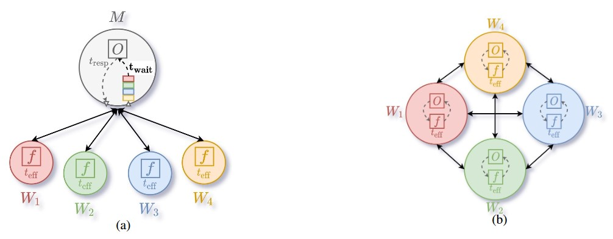
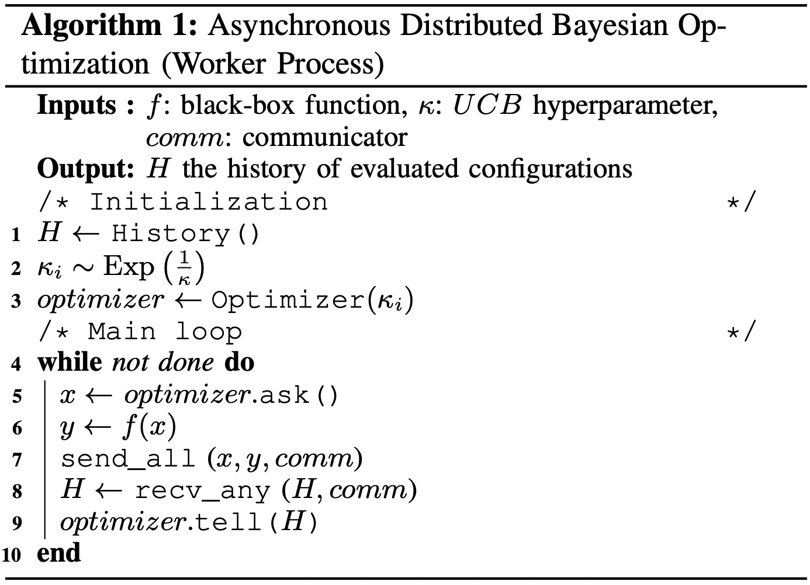

Introduction to Distributed Bayesian Optimization (DBO) with MPI (Communication) and Redis (Storage)
====================================================================================================

**Author(s)**: Joceran Gouneau & Romain Egele.

In this tutorial we show how to use the Distributed Bayesian Optimization (DBO) search algorithm with MPI (for the communication) and Redis (for the storage service) to perform hyperparameter optimization on the Ackley function.

MPI and Redis requirements
--------------------------

Before starting, make sure you have an installed implementation of MPI (e.g., openmpi) and RedisJson. The following instructions can be followed to install and start a Redis server with the RedisJSON module: 

.. code-block:: console

   # Activate first you conda environment
   $ conda activate dh

   # Then create a Spack environment to install RedisJson
   $ spack env create redisjson
   $ spack env activate redisjson
   $ spack repo add deephyper-spack-packages
   $ spack add redisjson
   $ spack install

   # Start the redis server
   $ redis-server $(spack find --path redisjson | grep -o "/.*/redisjson.*")/redis.conf

Definition of the problem : the Ackley function
-----------------------------------------------

.. image:: https://www.sfu.ca/~ssurjano/ackley.png
   :width: 400
   :alt: Ackley Function in 2D
   :align: center

.. math::

   f(x) = -a \exp \left( -b \sqrt {\frac 1 d \sum_{i=1}^d x_i^2} \right) - \exp \left( -b \sqrt {\frac 1 d \sum_{i=1}^d \cos(c x_i)} \right) + a + \exp(1)

.. note::

   We are using this function to emulate a realistic problem while keeping the definition of the hyperparameter search space and run function as simple as possible ; if you are searching for neural network use cases we redirect you to our others tutorials.

First we have to define the Hyperparameter search space as well as the run function, which, given a certain ``config`` of hyperparameters, should return the objective we want to maximize. We are computing the 10-D (:math:`d = 10`) Ackley function with :math:`a = 20`, :math:`b = 0.2` and :math:`c = 2\pi` and want to find its minimum :math:`f(x=(0, \dots , 0)) = 0` on the domain :math:`[-32.768, 32.768]^{10}`.
Thus we define the hyperparameter problem as :math:`x_i \in [-32.768, 32.768]~ \forall i \in [|0,9|]` and the objective returned by the ``run`` function as :math:`-f(x)`.

.. literalinclude:: ackley.py
   :language: python
   :caption: **file**: ``ackley.py``

Definition of the distributed Bayesian optimization search (DBO)
----------------------------------------------------------------

DBO (*right*) is very similar to Centralized Bayesian Optimization (CBO) (*left*) in the sense that we iteratively generate new configurations with an optimizer :math:`O`, evaluate them on Workers :math:`W` by calling the black-box function :math:`f` which takes :math:`t_{eff}` time to be computed, and fit the optimizer on the history of the search (the configuration/objective pairs) to generate better configurations.
The only difference is that with CBO the fitting of the optimizer and generation of new configurations is centralized on a Manager :math:`M`, while with DBO each worker has its own optimizer and these operations are parallelized.
This difference makes DBO a preferable choice when the run function is relatively fast and the number of workers increasing; with a large enough number of workers the fit of the optimizer (which has to be performed each time we generate a configuration) starts to take more time than the run function takes to be evaluated : at that point we obtain a congestion on the manager and  therefore workers become idle because waiting for a new configuration to be evaluated. DBO avoid this type of congestion issue by attributing one optimizer per worker and performing asynchronous communication between optimizers.

DBO can be formally described in the following algorithm:

Initialize MPI
______________

First we need to initialize MPI and get the communicator and the rank of the current worker, we can also import all required modules:

.. code-block:: python
   :caption: **files**: ``mpi_dbo_with_redis.py``

   from mpi4py import MPI

   from deephyper.search.hps import MPIDistributedBO

   from ackley import hp_problem, run

   comm = MPI.COMM_WORLD
   rank = comm.Get_rank()

Create the Evaluator
____________________

In DBO, the independant search instances in different ranks are communicating with each other through a storage. The storage is an instance of the ``deephyper.evaluator.storage.Storage`` class and is used to store the search data (e.g., the configuration/objective pairs).

.. code-block:: python
   :caption: **files**: ``mpi_dbo_with_redis.py``

   # Each rank creates a RedisStorage client and connects to the storage server
   # indicated by host:port. Then, the storage is passed to the evaluator.
   evaluator = MPIDistributedBO.bootstrap_evaluator(
      run,
      evaluator_type="serial", # one worker to evaluate the run-function per rank
      storage_type="redis",
      storage_kwargs={
         "host": "localhost",
         "port": 6379,
      },
      comm=comm,
      root=0,
   )

   # A new search was created by the bootstrap_evaluator function.
   if rank == 0:
      print(f"Search Id: {evaluator._search_id}")

Create and Run the Search
_________________________

The search can now be created using the previously created ``evaluator`` and the same communicator ``comm``:

.. code-block:: python
   :caption: **files**: ``mpi_dbo_with_redis.py``

   # The Distributed Bayesian Optimization search instance is created
   # With the corresponding evaluator and communicator.
   search = MPIDistributedBO(
      hp_problem, evaluator, log_dir="mpi-distributed-log", comm=comm
   )

   # The search is started with a timeout of 10 seconds.
   results = search.search(timeout=10)

The search can now be executed with MPI:

.. code-block:: console

   $ mpirun -np 4 python mpi_dbo_with_redis.py

Now check the ``mpi-distributed-log/results.csv`` file and it should contain about 40 (1 seconde per evaluator, 
4 search instancidated and 10 secondes in total) configurations and objectives (a bit less given some overheads).
