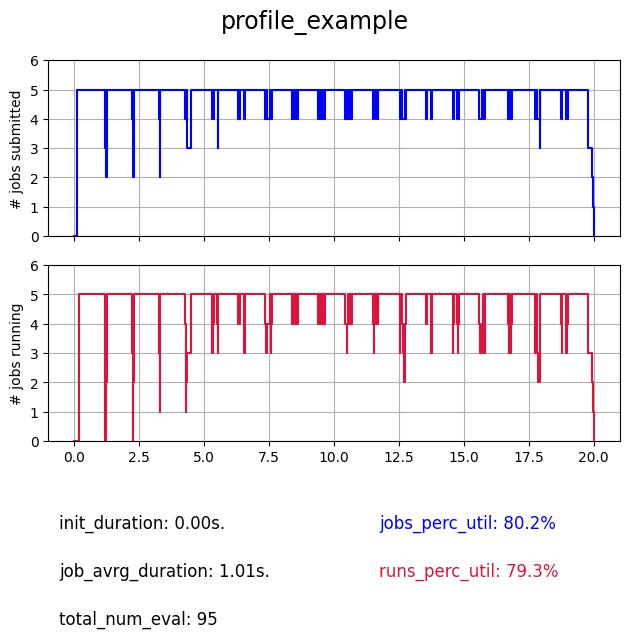
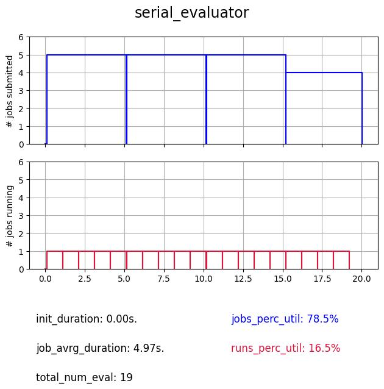
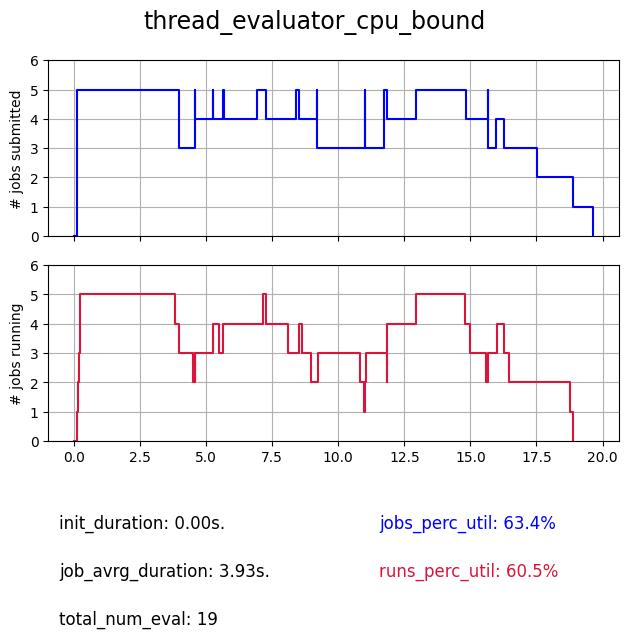
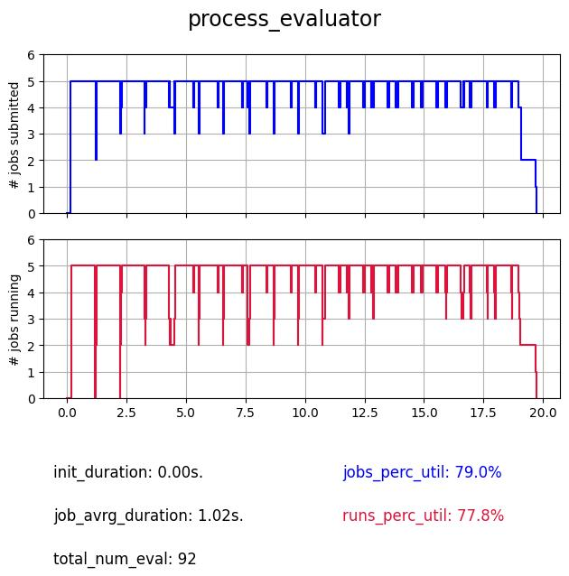
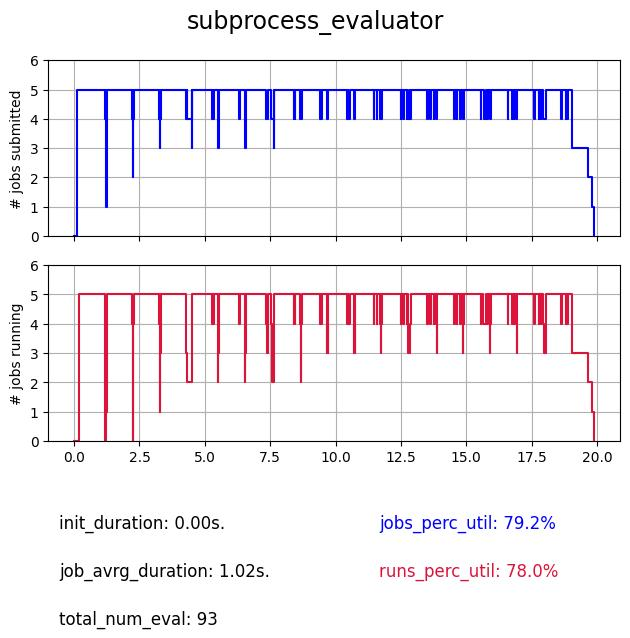
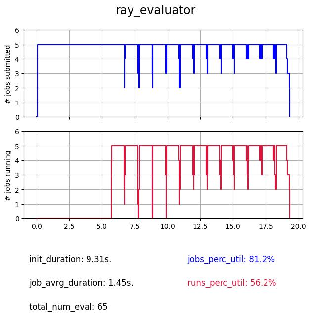
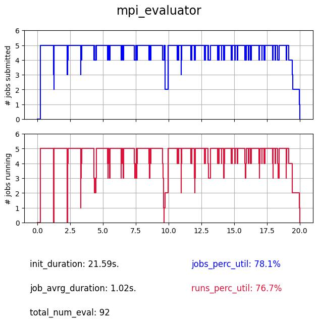

Understanding the pros and cons of Evaluator parallel backends
==============================================================

**Author(s)**: Joceran Gouneau & Romain Egele.

In this tutorial we make an overview and comparison of all the evaluators available within DeepHyper.

The common base on which are tested the evaluators
--------------------------------------------------

The problem : the Ackley function with fixed duration
_____________________________________________________

.. image:: https://www.sfu.ca/~ssurjano/ackley.png
   :width: 400
   :alt: Ackley Function in 2D
   :align: center

.. math::

   f(x) = -a \exp \left( -b \sqrt {\frac 1 d \sum_{i=1}^d x_i^2} \right) - \exp \left( -b \sqrt {\frac 1 d \sum_{i=1}^d \cos(c x_i)} \right) + a + \exp(1)

Let's first define a common problem on which compare the evaluators ; for that we use the Ackley function as it emulates a complex problem while keeping the definition of the hyperparameter search space and run function very simple.
Here we set :math:`d = 10`, :math:`a = 20`, :math:`b = 0.2` and :math:`c = 2\pi` and want to find its minimum :math:`f(x=(0, \dots , 0)) = 0` on the domain :math:`[-32.768, 32.768]^10`.
Thus we define the hyperparameter problem as :math:`x_i \in [-32.768, 32.768]~ \forall i \in [|0,9|]` and the objective returned by the ``run`` function as :math:`-f(x)`.

We also add a ``wait_function``, to get closer to a classic use-case in which the black-box function usually isn't as intantaneous as the evaluation of the Ackley function at a given point. We will always be using a simple ``basic_sleep`` function which only calls ``time.sleep(RUN_SLEEP)``, but in the case of the ``thread`` evaluator we will see that it is also usefull to make a distinction between a delay due to CPU or I/O communications limitations.

.. literalinclude:: ackley.py
   :language: python
   :caption: **file**: ``ackley.py``

.. note::

   We decorate the ``run``-function with ``@profile`` to collect exact run-times of the ``run``-function referenced as ``timestamp_start`` and ``timestamp_end`` in the results.

The search algorithm : as quick as possible
_____________________________________________________

We define a simple search receiving the chosen ``evaluator`` as well as the ``hp_problem`` defined in ``ackley.py``. 

.. warning::

   ``DUMMY`` is a surrogate model performing random search, meaning there is no time lost in fitting a model to the new evaluations. The parameter ``filter_duplicated=False`` makes it possible to re-generate already evaluated configurations, thus saving the time of of checking for duplicated configurations. These choices were made to minimize as much as possible the overheads of search algorithm (reduce the amount of mixed effects) in order to better highlight the overhead due to the choice of ``Evaluator``.

.. code-block:: python

   search = CBO(
        hp_problem,
        evaluator,
        surrogate_model="DUMMY",
        filter_duplicated=False
    )

    results = search.search(timeout=SEARCH_TIMEOUT)
    results.to_csv("results.csv")

This search instance is defined along with the functions used to evaluate the performances and plot the insights of an evaluator's execution in a ``common.py`` python script :

.. literalinclude:: common.py
   :language: python
   :caption: **file**: ``common.py``

The output : profile plots and insights
________________________________________

To execute a certain evaluator, you just have to run :

.. code-block:: console

   python evaluator_{type}.py

Except for MPI, which execution depends on your machine and your installation. This will generate a "profile" plot in the ``plots/`` directory such as:

where
- the **top** plot represents the number of **submitted** jobs (which means waiting for execution or being executed), it represents the state of the evaluator and how it manages these jobs.
- the **bottom** plot represents the number of simultaneously **running** jobs (jobs being executed), it represents the state of the workers and the true usage of allocated ressources (here ``NUM_WORKERS=5``).
- ``init_duration``: the duration of the initialization.
- ``job_avrg_duration``: the jobs average duration (from submission to collection, in other words ``run_duration + evaluator_overhead`` with ``RUN_SLEEP=1`` in ``ackley.py``).
- ``total_num_eval``: the total number of evaluations within the budget of 20 secondes for the search (``SEARCH_TIMEOUT=20``).
- two percentage of utilization (for each profile) corresponding to each profile (``jobs_perc_util`` for the top plot and ``runs_perc_util`` for the bottom plot). It is the area under the respective curves normalized by the theorical optimal case (maximal number of workers during the whole search, which is ``NUM_WORKERS * SEARCH_TIMEOUT``).

Serial
------

.. literalinclude:: evaluator_serial.py
   :language: python
   :caption: **file**: ``evaluator_serial.py``

The serial evaluator is the most basic, it is a single thread based evaluator, which means that whatever the number of workers it is given, it will always perform its evaluations sequentialy on one worker.

As we can see despite the fact that it is always submitting ``NUM_WORKERS`` jobs, in reality there is only one evaluation performed at a time, thus resulting in poor utilization of the computational ressources.

.. note::

   This evaluator is practicaly useful when debugging because everything is happening in the same Python thread.

.. warning::

   It is important to notice the ``if __name__ == "__main__":`` statement at the beginning of the script. Not all evaluators require it but it is a good practice to use it. Some evaluators will initialize new processes, potentially reloading the main script which could trigger a recursive infinite reloading of modules. Adding this statement avoids this type of issue.

Thread
------

.. literalinclude:: evaluator_thread.py
   :language: python
   :caption: **file**: ``evaluator_thread.py``

The thread evaluator is using the ``ThreadPoolExecutor`` backend. Therefore it has access to multiple Python threads (but Python is single threaded due to the global lock interpreter) and becomes usefull especially when I/O-bound computation is involved, as it can take advantages of these wait times switch to other threads and have a concurrent execution.

As we can see when computation is involved the profile is not maximized. But we expect a better utilization in case of I/O-bound functions which we illustrate bellow.:

.. image:: plots/thread_evaluator_IO_bound.jpg
   :scale: 100 %
   :alt: Search profile of the thread evaluator with IO communications limitations
   :align: center

The advantage of the thread evaluator on I/O communications is clear with 91 evaluations performed instead of 19.

Process
-------

.. literalinclude:: evaluator_process.py
   :language: python
   :caption: **file**: ``evaluator_process.py``

Then the ``process`` based evaluator is a better choice for cpu-bound functions. It also avoid repetitive overheads due to initialization of processes because the pool of processes is instanciated once and re-used.

Subprocess
----------

.. literalinclude:: evaluator_subprocess.py
   :language: python
   :caption: **file**: ``evaluator_subprocess.py``

The ``subprocess`` evaluator is similar to ``process`` but it creates new processes from scratch each time, it can be practicle in some cases to aleviate the limiates of ``process`` evaluator.

Ray
---

.. literalinclude:: evaluator_ray.py
   :language: python
   :caption: **file**: ``evaluator_ray.py``

The Ray evaluator uses the ``ray`` library as backend, its advantage comes from the fact that once ray workers are instanciated they are not stopped till the end of the search, which means that once an import is made it doesn't have to be re-performed at each evaluation, which can save a lot of time on certain tasks. The major drawback is that this setup requires an initialization of the Ray-cluster which can take time and be complex and source of issues on very large systems.

As we can see the initialization takes here (on a simple system with 6 cores) around 9s., and there is also an overhead of 5s. happening at the beggining of the search for initializing the communications. But once it is started it is as concistent as process and subprocess, and can keep it up with more workers.

MPI
---

.. literalinclude:: evaluator_mpi.py
   :language: python
   :caption: **file**: ``evaluator_mpi.py``

The MPI evaluator uses the ``mpi4py`` library as backend, like the Ray evaluator imports are done once and not re-performed at each evaluation, to execute it you need an ``MPI`` instance your machine, which is common on big systems thus making it the most convenient choice to perform searches at scale.

This has to be executed with MPI such as:

.. code-block:: console

   $ mpirun -np 6 python evaluator_mpi.py

Like the Ray evaluator, there is an initialization taking here around 20s., but once launched there is very few overhead. Also this initialization step can be optimized depending on the local MPI implementation. For example in our case we use:

.. code-block:: python

   import mpi4py

   mpi4py.rc.initialize = False
   mpi4py.rc.threads = True
   mpi4py.rc.thread_level = "multiple"