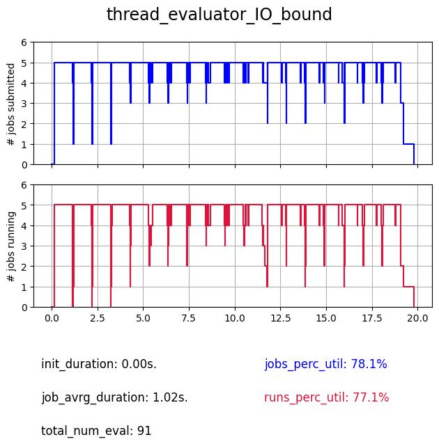

The Different Evaluators
========================

In this tutorial we make an overview and comparison of all the evaluators available within DeepHyper.

The common base on which are tested the evaluators
--------------------------------------------------

The problem : the Ackley function with fixed duration
_____________________________________________________

.. image:: figures/ackley.png
   :scale: 100 %
   :alt: Representation of the 2-D Ackley function
   :align: center

.. math::

   f(x) = -a \exp \left( -b \sqrt {\frac 1 d \sum_{i=1}^d x_i^2} \right) - \exp \left( -b \sqrt {\frac 1 d \sum_{i=1}^d \cos(c x_i)} \right) + a + \exp(1)

Let's first define a common problem on which compare the evaluators ; for that we use the Ackley function as it emulates a complex problem while keeping the definition of the hyperparameter search space and run function very simple.
Here we set :math:`d = 10`, :math:`a = 20`, :math:`b = 0.2` and :math:`c = 2\pi` and want to find its minimum (:math:`f(x=(0, \dots , 0)) = 0`) on the domain :math:`[-32.768, 32.768]^10`.
Thus we define the hyperparameter problem as :math:`x_i \in [-32.768, 32.768] \forall i \in 1..10` and the objective returned by the ``run`` function as :math:`-f(x)`.

We also add a ``wait_function``, to get closer to a classic use-case in which the black-box function usually isn't as intantaneous as the evaluation of the Ackley function at a given point. We will always be using a simple ``basic_sleep`` function which only calls ``time.sleep(RUN_SLEEP)``, but in the case of the ``thread`` evaluator we will see that it is also usefull to make a distinction between a delay due to CPU or I/O communications limitations.

.. literalinclude:: ackley.py
   :language: python
   :caption: **file**: ``ackley.py``

The search algorithm : as quick as possible
_____________________________________________________

We define a simple search receiving the chosen ``evaluator`` as well as the ``hp_problem`` defined in ``ackley.py``. 

.. note::

   ``DUMMY`` is a surrogate model performing random search, meaning there is no time lost in fitting a model to the new evaluations. The parameter ``filter_duplicated=False`` makes it possible to generate already evaluated configurations, thus saving the time of verifying generated configurations and re-generating these when already evaluated. These choices were made to minimize as much as possible the time spent by the search algorithm in order to better highlight the overhead due to the evaluator alone.

.. code-block:: python
   :caption: **file**: ``common.py``

   search = CBO(
        hp_problem,
        evaluator,
        surrogate_model="DUMMY",
        filter_duplicated=False
    )

    results = search.search(timeout=SEARCH_TIMEOUT)
    results.to_csv("results.csv")

The output : profile plots and insights
________________________________________

Here is an example of the informations we collect from the executions :

.. image:: plots/profile_example.jpg
   :scale: 100 %
   :alt: Example of a search profile
   :align: center

- two profiles :

   - the first one is the number of simultaneously submitted jobs (which means waiting for execution or being performed), it represents the state of the evaluator and how it manages these jobs.

   - the second one is the number of simultaneously running jobs (jobs being performed), it represents the state of the workers and the true usage of the allocated ressources (``NUM_WORKERS=5``).

- the duration of the initialization.

- the jobs average duration (from submission to collection, in other words ``run_duration + evaluator_overhead`` with ``RUN_SLEEP=1`` in ``ackley.py``) .

- the total number of evaluations within the 20s. search (``SEARCH_TIMEOUT=20``).

- two percentage of utilization (for each profile) correspnding to the portion of area under the curve (the maximal area corresponding to a maximal use of the workers during the whole search, which is ``NUM_WORKERS * SEARCH_TIMEOUT``).

Serial
------

.. literalinclude:: evaluator_serial.py
   :language: python
   :caption: **file**: ``evaluator_serial.py``

The serial evaluator is the most basic, it is a single thread based evaluator, which means that whatever the number of workers it is given, it will always perform its evaluations sequentialy on one worker.

As we can see despite the fact that it is always submitting ``NUM_WORKERS`` jobs, in reality there is only one evaluation performed at a time, thus resulting in poor utilization of the computational ressources.

Thread
------

.. literalinclude:: evaluator_thread.py
   :language: python
   :caption: **file**: ``evaluator_thread.py``

The thread evaluator is, like the serial evaluator, single-threaded, it uses the ``ThreadPoolExecutor`` backend and becomes usefull only when I/O communications are involved, as it can take advantages of these to parallelize work.

.. image:: plots/thread_evaluator_cpu_bound.jpg
   :scale: 100 %
   :alt: Search profile of the thread evaluator with CPU limitations
   :align: center

As we can see when computation is involved the parallelization is not perfect, but in the case of even more computation intensive run functions we can expect its behaviour to be close to sequential evaluation of the serial evaluator. 

The advantage of the thread evaluator on I/O communications is illustrated, as we have a better parallelization on the ``NUM_WORKERS`` workers.

Process
-------

.. literalinclude:: evaluator_process.py
   :language: python
   :caption: **file**: ``evaluator_process.py``

.. image:: plots/process_evaluator.jpg
   :scale: 100 %
   :alt: Search profile of the process evaluator
   :align: center

Subprocess
----------

.. literalinclude:: evaluator_subprocess.py
   :language: python
   :caption: **file**: ``evaluator_subprocess.py``

.. image:: plots/subprocess_evaluator.jpg
   :scale: 100 %
   :alt: Search profile of the subprocess evaluator
   :align: center

Ray
---

.. literalinclude:: evaluator_ray.py
   :language: python
   :caption: **file**: ``evaluator_ray.py``

The Ray evaluator uses the ``ray`` library as backend, its advantage comes from the fact that once ray workers are instanciated they are not stopped till the end of the search, which means that once an import is made it doesn't have to be re-performed at each evaluation, which can save a lot of time on certain projects. The major drawback is that this setup requires an initialization which can take time and be complex and source of issues on big systems.

.. image:: plots/ray_evaluator.jpg
   :scale: 100 %
   :alt: Search profile of the Ray evaluator
   :align: center

As we can see the initialization takes here (on a simple system with 6 cores) around 9s., and there is also an overhead of 5s. happening at the beggining of the search for initializing the communications. But once it is started it is as concistent as process and subprocess, and can keep it up with more workers.

MPI
---

.. literalinclude:: evaluator_mpi.py
   :language: python
   :caption: **file**: ``evaluator_mpi.py``

The MPI evaluator uses the ``mpi4py`` library as backend, like the Ray evaluator imports are done once and not re-performed at each evaluation, to execute it you need an ``MPI`` instance your machine, which is common on big systems thus making it the most convenient choice to perform searches at scale.

Like the Ray evaluator, there is an initialization taking here around 20s., but once launched there is very few overhead.